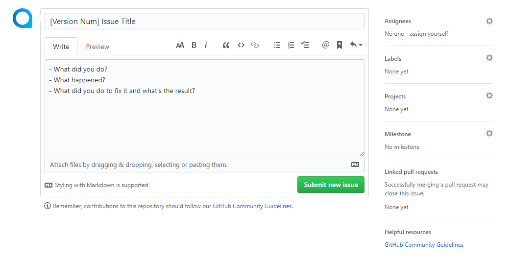

# Contributing Guideline

tooltiplery.js is an open source project and made possible by the open source community.

## Issues

Submit a new issue like this:



### Title

[Version Num] Issus Title

### Content

- What did you do?
- What happened?
- What did you do to fix it and what's the result?

**The more detailed, the better.**

## Code

### JavaScript

#### Variables and Constants

Name as `myVariablesAndConstants`, not:

- `myVariablesandConstants`
- `MyVariablesAndConstants`
- `my_variables_and_constants`

#### Spacing

##### Bad Examples

```javascript
if(!condition)console.log("true!");
for(var i = 0;i<10;i++)console.log(i);
```

##### Good Examples

```javascript
if (!condition) { // no white spaces between ( )
    console.log("true!");
    condition = false;
    // four spaces as one tab
} // no whitespace at the end of line or on blank lines

for (var i = 0; i < 10; i++) { console.log(i); }
// always have braces
// go on only one line when there's only one statement

// new line at the end of the file

```

#### Objects and Arrays

##### Bad Examples

```javascript
var obj = { one: 1, two: 2, three: 3, arr: [1, 2, 3] };
```

##### Good Examples

```javascript
var obj = {
    one: 1,
    two: 2,
    arr: [ 1, 2 ], // go on only one line and no comma after the last item when there's less than 3 items
    three: 3, // one comma after the last item
};
```

<br/>

---

**Still writing...**